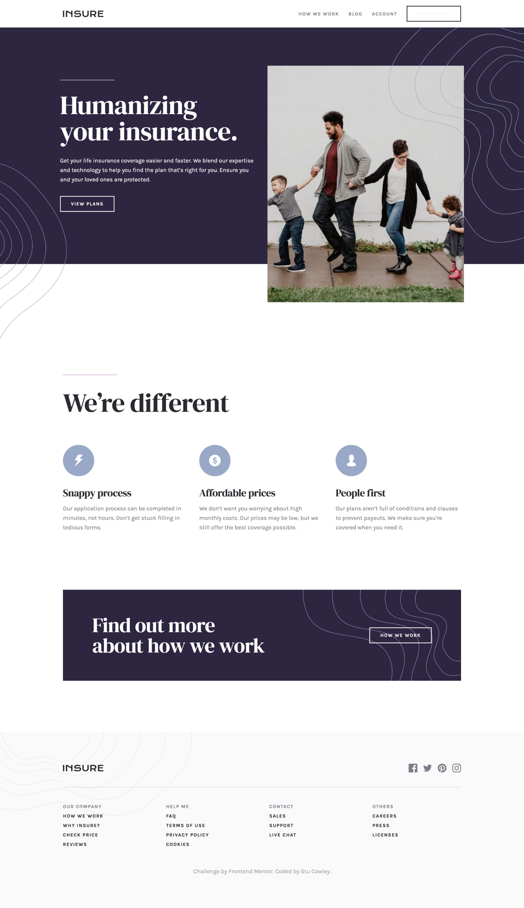

# Frontend Mentor - Insure landing page solution

This is a solution to the [Insure landing page challenge on Frontend Mentor](https://www.frontendmentor.io/challenges/insure-landing-page-uTU68JV8). Frontend Mentor challenges help you improve your coding skills by building realistic projects.

## Table of contents

-   [Overview](#overview)
    -   [The challenge](#the-challenge)
    -   [Screenshot](#screenshot)
    -   [Links](#links)
-   [My process](#my-process)
    -   [Built with](#built-with)
    -   [What I learned](#what-i-learned)
    -   [Continued development](#continued-development)
-   [Author](#author)

## Overview

### The challenge

Users should be able to:

-   View the optimal layout for the site depending on their device's screen size
-   See hover states for all interactive elements on the page

### Screenshot

### Links

-   Solution URL: [https://github.com/frontendstu/insure-landing-page](https://github.com/frontendstu/insure-landing-page)
-   Live Site URL: [https://frontendstu.github.io/insure-landing-page/](https://frontendstu.github.io/insure-landing-page/)

## My process

### Built with

-   Semantic HTML5 markup
-   CSS custom properties
-   Flexbox
-   CSS Grid
-   Mobile-first workflow
-   Sass

### What I learned

This was a good refresher project for me after taking some time away from frontend development. I found a couple of elements a bit tricky to remember, but they came back to me after awhile.

### Continued development

I struggled a fair bit with the patterns within the hero. I found that using the `::before` and `::after` pseudo-elements helped to position the left pattern (`::before`) and the right pattern (`::after`). I probably failed on this and it is something that I should be focusing my learning as I do struggle a bit with patterns in most of the Frontend Mentor challenges.

## Author

-   Frontend Mentor - [@frontendstu](https://www.frontendmentor.io/profile/frontendstu)
-   Github - [https://github.com/frontendstu/](https://github.com/frontendstu/)
